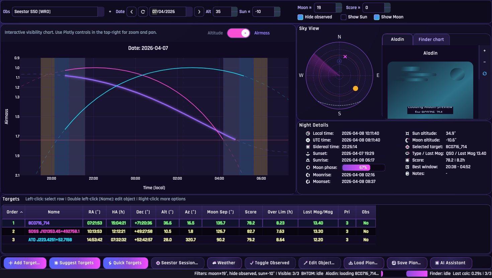
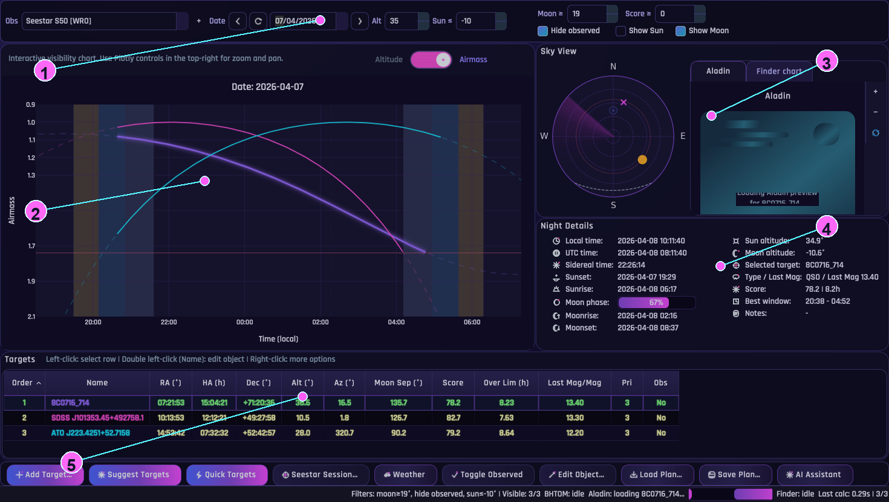
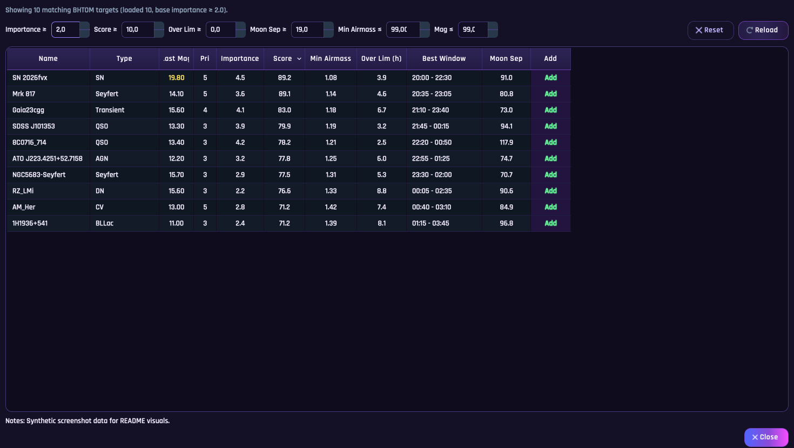
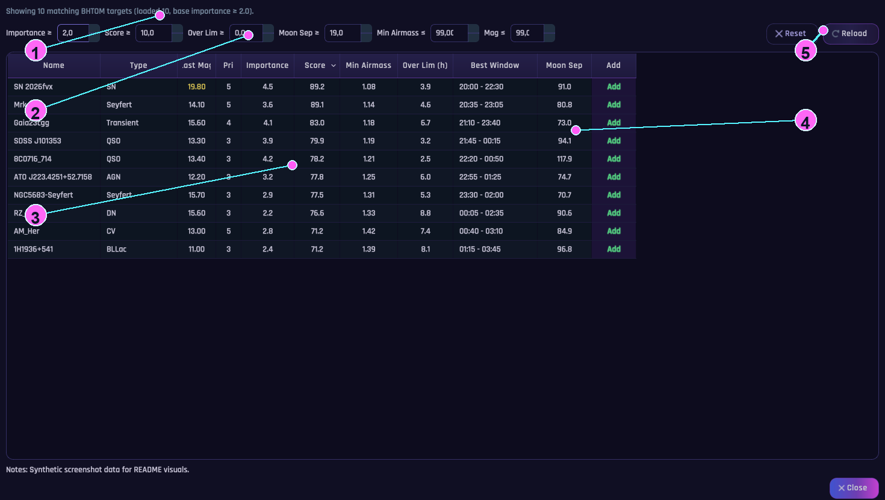
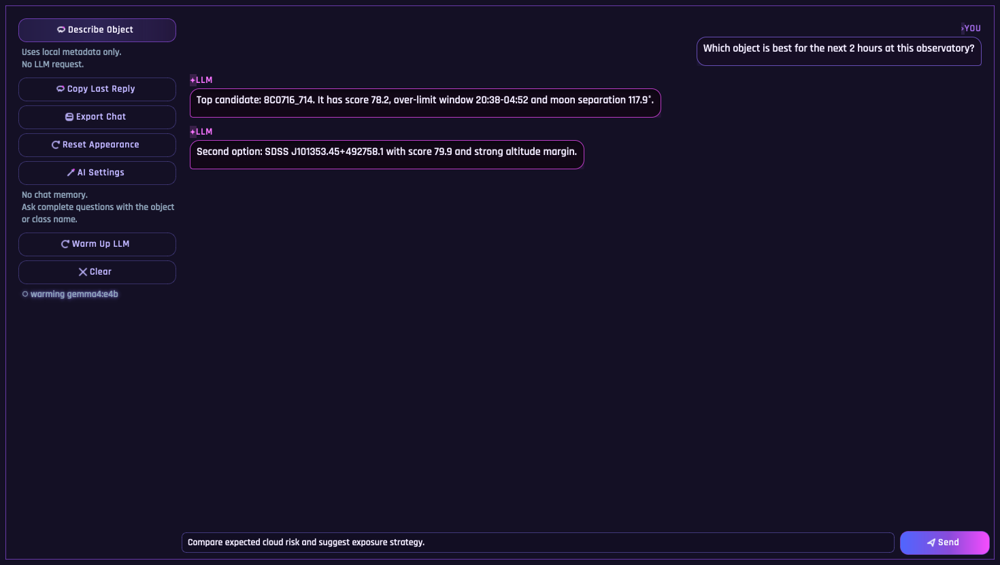
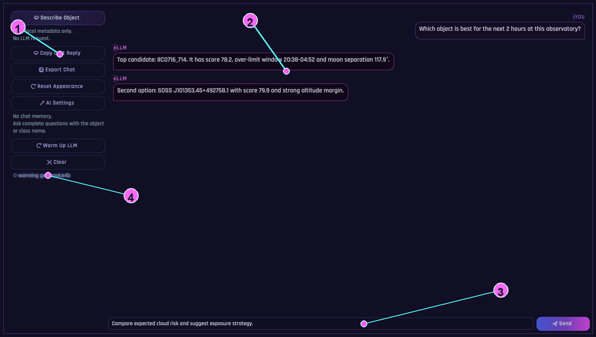
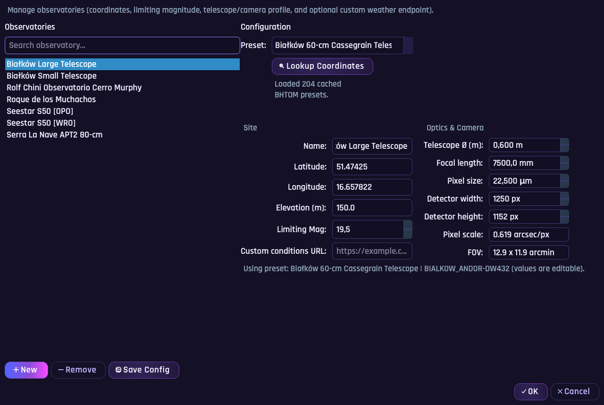

# Astronomical Observation Planner

Desktop GUI for planning night observations with `PySide6`, `astroplan`, `astropy`, and `matplotlib`.

## Screenshots

### Main Dashboard



Annotated overlay:



Dashboard overlay legend:

- `1)` Top session/filter row (`Obs`, date, limits, score/moon/show flags).
- `2)` Main visibility panel (interactive Altitude/Airmass chart).
- `3)` Sky View block (radar + Aladin/Finder tabs).
- `4)` Night Details metrics card.
- `5)` Targets table + action toolbar region.

### Suggest Targets



Annotated overlay:



Suggest overlay legend:

- `1)` Result summary (loaded vs currently matching targets).
- `2)` Filter row (`Importance`, `Score`, `Over Lim`, `Moon Sep`, `Airmass`, `Mag`).
- `3)` Main sortable candidate table.
- `4)` `Add` action column for direct insertion into the plan.
- `5)` `Reset` / `Reload` controls.

### AI Assistant Window



Annotated overlay:



AI overlay legend:

- `1)` Quick actions column (`Describe Object`, chat tools, AI settings, warm-up).
- `2)` Chat transcript area (user + LLM responses).
- `3)` Prompt composer row (`input` + `Send`).
- `4)` Warm/cold runtime badge for local LLM state.

### Observatory Manager



Screenshot refresh tooling:

- Capture base screenshots:
  - `python scripts/capture_readme_screenshots.py --views all`
- Generate overlays:
  - `python scripts/generate_readme_overlays.py --views all`

## Key Features

- Data-dense dashboard: visibility plot, sky radar, cutout/finder chart, night details, and target table.
- Target planning metrics: `Score`, `Over Lim (h)`, Moon separation, and best observing window.
- Suggestion workflow:
  - `Suggest Targets` dialog with sorting/filtering.
  - `Quick Targets` button to add top ranked suggestions fast.
  - dedicated `Settings -> General Settings -> Quick Targets` controls.
- Enhanced target add flow:
  - resolver-backed lookup (`SIMBAD`, `Gaia DR3`, `Gaia Alerts`, `TNS`, `NED`, `LSST`).
  - metadata enrichment (`magnitude`, `type`) when available.
  - editable `name`, `type`, `notes`, and color.
- Sky field preview:
  - Aladin cutout with zoom/pan/reset controls and telescope FOV overlay.
  - Finder chart tab with consistent scale/overlay.
- AI Assistant as a separate window:
  - dedicated menu action (`AI -> Toggle AI window`) and bottom toolbar button.
  - object description shortcuts plus local LLM chat (OpenAI-compatible endpoint).
- Weather workspace:
  - tabs: `Meteograms`, `Conditions`, `Cloud Analysis`, `Satellite (beta)`.
  - async provider loading with status chips and partial-failure handling.
  - live conditions source selector and per-observatory custom endpoint support.
- Theme and readability controls:
  - multiple cyberpunk UI themes with secondary accent override.
  - configurable global UI/table font size.
  - `File -> Toggle Dark/Light Mode`.
- Export bundle:
  - `plan_targets.json`
  - `plan_plot.png`
  - `plan_summary.csv`
  - `plan_schedule.ics`

## Weather Workspace

Weather UI tabs:

- `Meteograms` for model forecast curves.
- `Conditions` for current/near-real-time station-style data.
- `Cloud Analysis` for weighted cloud/clear-rate estimate and monthly map.
- `Satellite (beta)` for in-app satellite preview.

Conditions sources:

- `Open-Meteo` (no key).
- nearest `METAR` station (AviationWeather API).
- observatory-level `Custom URL` JSON endpoint.
- reference portal links in the UI: WeatherCloud / Wunderground / Windy.

Custom conditions URL contract (required keys):

- `temp_c`
- `wind_ms`
- `cloud_pct`
- `rh_pct`

Optional condition keys:

- `pressure_hpa`
- `updated_utc`
- `source_label`
- `series` arrays (`timestamps`, `temp_c`, `wind_ms`, `cloud_pct`, `rh_pct`, `pressure_hpa`)

Cloud calculation in `Cloud Analysis`:

- `effective_cloud = 0.65*low + 0.25*mid + 0.10*high`
- `clear_rate = 100 - effective_cloud`

Weather settings:

- per observatory (`Settings -> Observatory Manager…`): `Custom conditions URL`.
- global (`Settings -> General Settings -> Weather`):
  - default conditions source
  - auto refresh interval
  - cloud map source
  - cloud map month mode (`session month` / `current month`)

## Score Calculation

`Score` is computed per target from three components (then scaled by priority/observed):

- `visibility component` (0..50): based on `Over Lim (h)`  
  `vis = clamp(hours_above_limit / 6.0, 0, 1) * 50`
- `altitude component` (0..30): based on max altitude during valid observing samples  
  `alt = clamp((max_altitude_deg - 20) / 60, 0, 1) * 30`
- `moon component` (0..20): based on peak Moon separation  
  `moon = clamp(peak_moon_sep_deg / 180, 0, 1) * 20`

Base score:

- `base = vis + alt + moon`

Multipliers:

- `priority_mult = 0.7 + 0.3 * clamp(priority / 5, 0, 1)` (priority 1..5)
- `observed_mult = 0.5` if target is marked observed, else `1.0`

Final value:

- `score = round(base * priority_mult * observed_mult, 1)`

Important detail: all of the above are evaluated only on samples inside the observing night mask (`Sun altitude <= Sun limit` from the top filter, default `-10°`).

## BHTOM Requirement (Suggest/Quick Targets)

`Suggest Targets` and `Quick Targets` use the BHTOM target-list API and require:

- a BHTOM account
- a valid BHTOM API token

Set the token in:

- `Settings -> General Settings -> Integrations -> BHTOM API token`

## Observatory Configuration

User observatories are stored in the SQLite app database (`app.db`).

AstroPlanner uses SQLite as the only runtime app-storage backend. Legacy `QSettings`
and `settings.ini` fallbacks are no longer part of the startup path.

The repository ships a read-only seed file for first-run defaults:

- `config/default_observatories.json`

Each observatory entry includes:

- `name`
- `latitude`
- `longitude`
- `elevation`
- `limiting_magnitude` (used as the red-warning threshold for faint magnitudes in `Suggest Targets`)

You can manage observatories directly in the app via:

- `Settings -> Observatory Manager…`
- `+` button next to the `Obs` selector

## Installation

Clone and enter the repository:

```bash
git clone <repo-url> astroplanner
cd astroplanner
```

### Conda (recommended)

```bash
conda env create -f environment.yml
conda activate astroplanner
```

### Python venv

```bash
python3 -m venv venv
source venv/bin/activate  # Windows: venv\\Scripts\\activate
pip install --upgrade pip
pip install -r requirements.txt
```

## Quickstart

Basic desktop app:

```bash
python astro_planner.py
```

Useful local stack shortcuts:

```bash
make help
make llm-install-help
make llm-pull
make llm-check
make llm-up-docker
make up-seestar-sim
make ps
```

What they do:

- `make llm-install-help`: shows how to install Ollama before using the AI panel
- `make llm-pull`: pulls the default local Gemma 4 model into Ollama
- `make llm-check`: verifies the local Ollama OpenAI-compatible endpoint on `http://localhost:11434`
- `make llm-up-docker`: starts optional Dockerized Ollama on the same endpoint (`http://localhost:11434`) for Linux / CPU tests
- `make up-seestar-sim`: starts `seestar_alp` plus the local simulator, with API on `http://localhost:5555` and web UI on `http://localhost:5432`
- `make ps`: shows the current AstroPlanner Docker stack status

Typical local workflow:

1. Install Python dependencies and run `python astro_planner.py`.
2. If you want the AI panel, install Ollama first with `make llm-install-help`.
3. Pull the default model with `make llm-pull`.
4. Verify the local LLM endpoint with `make llm-check`.
5. If you want Seestar integration without hardware, run `make up-seestar-sim`.
6. Preview `seestar_alp` in a browser at `http://localhost:5432`.
7. In AstroPlanner, point the AI panel to `http://localhost:11434` and Seestar ALP to `http://localhost:5555`.

Optional Linux / CPU test path:

1. Run `make llm-up-docker`
2. Run `make llm-pull-docker`
3. Run `make llm-check`

## Run

```bash
python astro_planner.py
```

Load a plan at startup:

```bash
python astro_planner.py --plan plan_targets.json
```

On macOS:

```bash
./run.command
```

## AI Assistant

The AI panel supports a local OpenAI-compatible endpoint. The default setup uses host-managed Ollama with `gemma4:e4b`.

Optional: the repo also provides a Docker Compose `ollama` profile for Linux / CPU tests. On macOS, Ollama's own guidance is to run the standalone app outside Docker.

Prepare the local LLM:

```bash
make llm-install-help
make llm-pull
make llm-check
```

Then configure in the app:

- `Settings -> General Settings`
- `LLM server URL`: `http://localhost:11434`
- `LLM model`: `gemma4:e4b`

Full setup guide:

- [README_LLM_SETUP.md](README_LLM_SETUP.md)

## Seestar ALP

For local Seestar integration with the simulator:

```bash
make up-seestar-sim
```

This exposes:

- `Seestar ALP API`: `http://localhost:5555`
- `Seestar ALP Web UI`: `http://localhost:5432`

Inside AstroPlanner:

- set `Backend` to `Seestar ALP service`
- set `ALP base URL` to `http://localhost:5555`
- use `Open ALP Web UI` or open `http://localhost:5432` directly

Full setup guide:

- [docs/seestar_alp.md](docs/seestar_alp.md)
