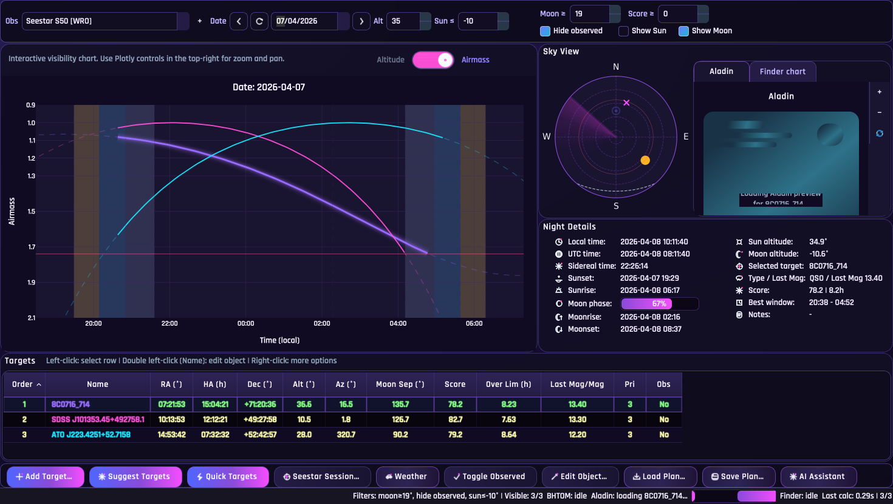
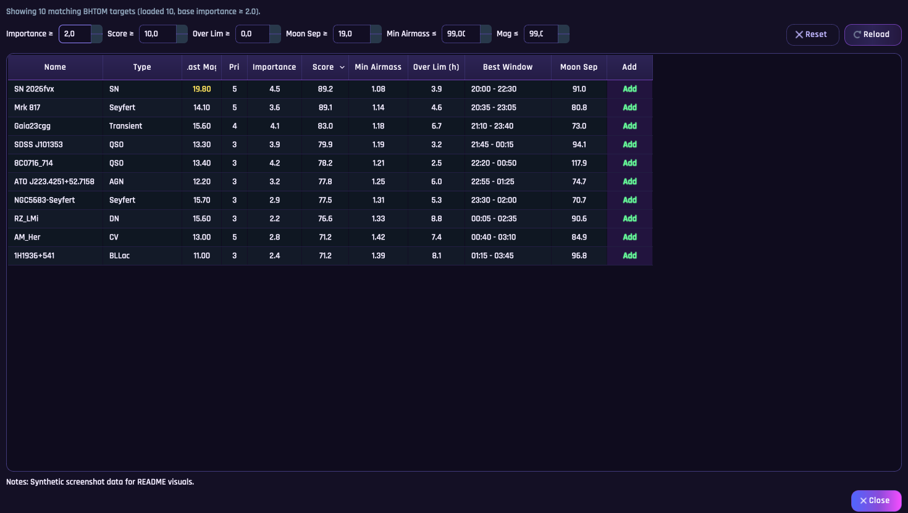
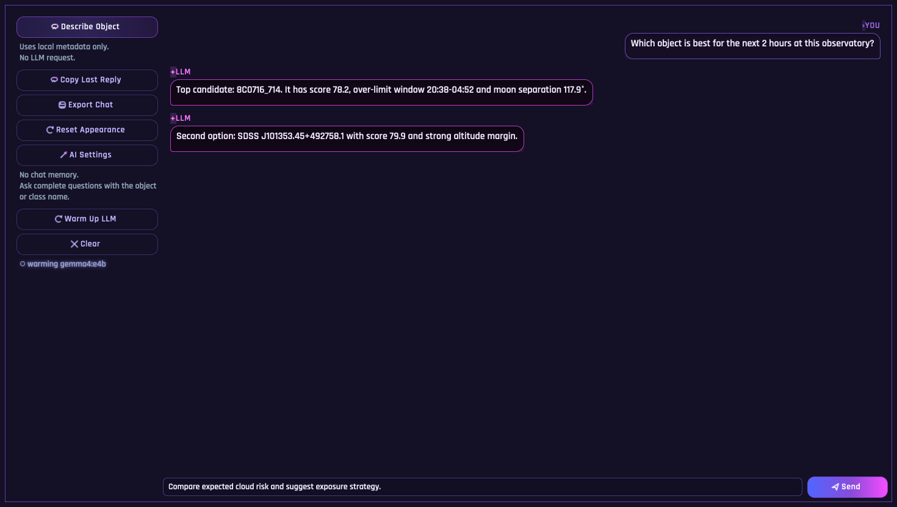
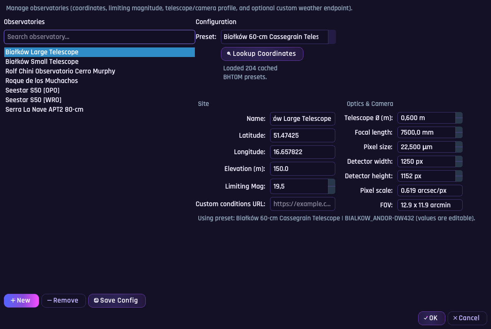

# AstroPlanner — Astronomical Observation Planner

[](https://github.com/kkotysz/astroplanner/actions/workflows/ci.yml)

A desktop scientific application for planning astronomical observations, combining **astronomical computation, external data services, interactive visualization, local data storage, weather analysis, telescope integration, and optional local LLM support**.

Built primarily with `Python`, `PySide6`, `Astropy`, `Astroplan`, `Matplotlib`, `Plotly`, `SQLite`, and Docker-based integration tooling.

## Engineering highlights

AstroPlanner is more than a plotting GUI. It brings together several technical domains in one application:

- **Scientific computing** — visibility, altitude/airmass, Moon separation, observing windows, target scoring and night constraints.
- **External API integration** — object resolution and metadata from services including SIMBAD, Gaia, TNS, NED and BHTOM.
- **Desktop application architecture** — a modular PySide6 application with coordinators separating UI workflows from domain logic.
- **Data persistence** — SQLite-backed configuration and application state.
- **Asynchronous data loading** — weather and external services can fail independently without blocking the whole workspace.
- **Visualization** — interactive visibility plots, sky views, finder charts and observation dashboards.
- **Hardware/software integration** — optional Seestar ALP integration with a local simulator workflow.
- **AI integration** — optional OpenAI-compatible local LLM backends such as Jan, Ollama, LM Studio or llama.cpp.
- **Reproducible development environment** — Conda/venv setup, `Makefile`, Docker Compose helpers and automated tests.
- **Automated testing** — tests cover astronomy logic, storage, resolvers, integrations, coordinators and UI helpers.

For a higher-level description of the code structure, see [`docs/architecture.md`](docs/architecture.md).

## Screenshots

### Main dashboard



The dashboard combines observing constraints, an interactive altitude/airmass plot, sky view, night metrics and target management in one workspace.

### Target suggestions



Targets can be ranked and filtered using visibility, Moon separation, magnitude, observing duration and project-specific priority information.

### AI assistant



The assistant runs against an optional OpenAI-compatible local backend and can use application context to help describe objects and support observing decisions.

### Observatory manager



## Key features

- Interactive altitude/airmass visibility analysis.
- Night-aware target scoring and best-window calculation.
- Target lookup through `SIMBAD`, `Gaia DR3`, `Gaia Alerts`, `TNS`, `NED` and `LSST`-related workflows.
- BHTOM target-list integration.
- Aladin/finder-chart field previews and telescope field-of-view overlays.
- Weather workspace with meteograms, live conditions, cloud analysis and satellite preview.
- Configurable observatories stored in SQLite.
- Export to JSON, CSV, PNG and ICS.
- Optional local LLM assistant.
- Optional Seestar ALP telescope integration and simulator stack.

## Target score

The target score combines three observing-quality components:

- visibility duration: `0..50`
- maximum altitude: `0..30`
- Moon separation: `0..20`

The base score is then scaled by target priority and whether the object has already been observed. All calculations are evaluated only inside the configured astronomical-night mask.

## Weather workspace

Available weather views include:

- `Meteograms`
- `Conditions`
- `Cloud Analysis`
- `Satellite (beta)`

Supported condition sources include Open-Meteo, nearby METAR stations and a custom observatory JSON endpoint. The custom endpoint can expose temperature, wind, humidity, pressure and cloud-cover information together with optional time series.

## Observatory configuration

User observatories are stored in the SQLite application database (`app.db`). A read-only seed file with defaults is included in:

```text
config/default_observatories.json
```

Observatories can be managed directly from the application through the Observatory Manager.

## Installation

### Conda

```bash
git clone https://github.com/kkotysz/astroplanner.git
cd astroplanner
conda env create -f environment.yml
conda activate astroplanner
python astro_planner.py
```

### Python venv

```bash
git clone https://github.com/kkotysz/astroplanner.git
cd astroplanner
python3 -m venv venv
source venv/bin/activate
pip install --upgrade pip
pip install -r requirements.txt
python astro_planner.py
```

On Windows, activate the environment with:

```text
venv\Scripts\activate
```

## Example plan

Run the application with the included example:

```bash
python astro_planner.py --plan examples/plan_targets.json
```

On macOS, the repository also includes:

```bash
./run.command
```

## Development helpers

Useful commands are exposed through the `Makefile`:

```bash
make help
make llm-install-help
make llm-pull
make llm-check
make llm-up-docker
make up-seestar-sim
make ps
```

The Docker helpers are optional. The desktop application itself does not require Docker.

## AI assistant

AstroPlanner can connect to an OpenAI-compatible local chat backend. Supported setups include Jan, Ollama, Docker Model Runner, LM Studio, llama.cpp server, vLLM and compatible services exposing `POST /v1/chat/completions`.

See:

- [`docs/llm_setup.md`](docs/llm_setup.md)

## Seestar ALP integration

A local simulator workflow is included for development without telescope hardware:

```bash
make up-seestar-sim
```

See:

- [`docs/seestar_alp.md`](docs/seestar_alp.md)

## Tests

Install test dependencies and run:

```bash
pip install pytest
pytest -q
```

The test suite covers core astronomy calculations, storage, external resolvers and integrations, application coordinators, visibility plotting and selected UI workflows.

## Project status

This is an actively developed scientific-software project and a practical workbench used to connect astronomical planning logic with real data services and observing workflows.
